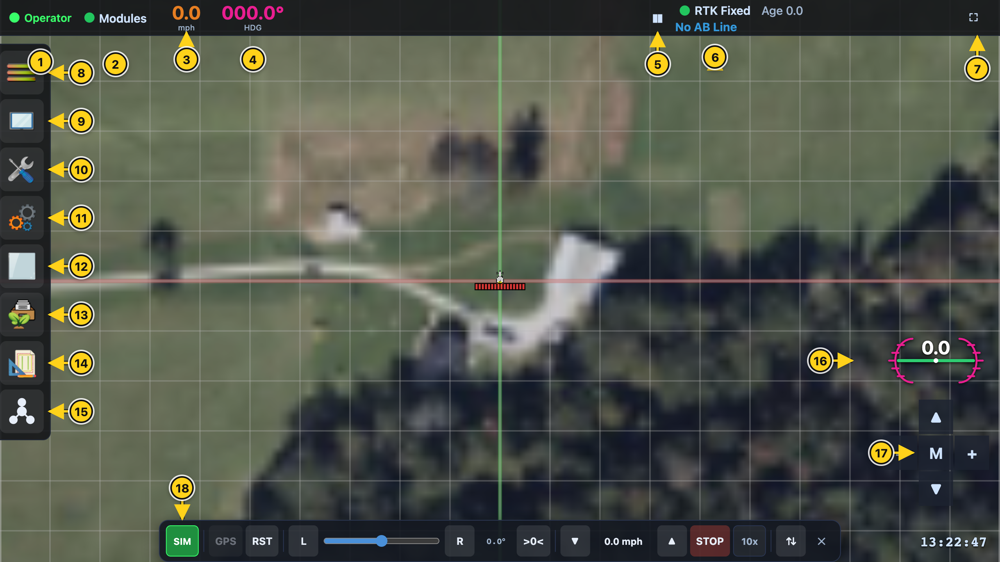
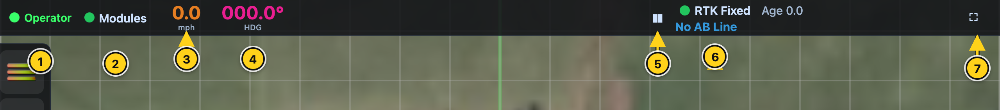
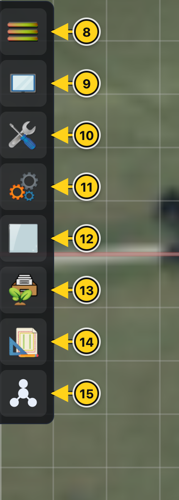
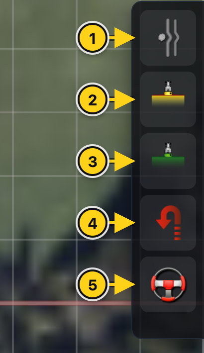
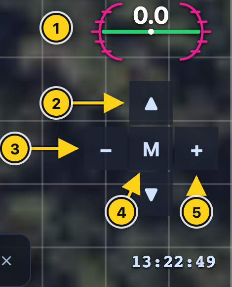
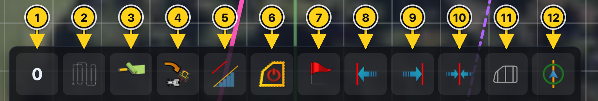
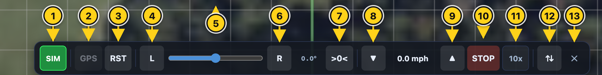

# AgOpenWeb Screen &amp; Buttons Guide

This guide explains every icon and button on the AgOpenWeb screen and what it does. It's organized
by **where each control lives on screen**. Each picture has numbered markers; the list beneath it
tells you what each number does.

Some buttons are **greyed out / locked** unless this device is the one in control of the machine
(the "operator"). A tablet connected only to watch will see them disabled — this is a safety
feature, covered at the [end](#a-note-on-locked-greyed-out-buttons).

## The whole screen

**Top status bar:** ① Control role · ② Modules status · ③ Speed · ④ Heading · ⑤ Pause info line ·
⑥ GPS fix · ⑦ Fullscreen
**Left navigation bar:** ⑧ File menu · ⑨ Screen &amp; Alerts · ⑩ Tools · ⑪ Vehicle &amp; Tool ·
⑫ AutoSteer · ⑬ Field operations · ⑭ Field tools · ⑮ Network IO
**Map overlays:** ⑯ Roll gauge · ⑰ Camera pad · ⑱ Simulator bar

The **right navigation bar** and the **bottom field-operations bar** only appear once a field is
open — they're shown in their own sections below.

Jump to: [Status bar](#top-status-bar) · [Left nav](#left-navigation-bar) ·
[Right nav](#right-navigation-bar) · [Camera pad](#camera-pad) · [Bottom bar](#bottom-navigation-bar) ·
[Simulator bar](#simulator-bar) · [Configuration](#configuration-screens) ·
[Field building](#field-building-tools)

---

## Top status bar

Live readouts across the top of the screen. Most items are also buttons that open a detail popup.

1. **Control role** — whether this device is the **Operator** (in control), a **Follower**
   (watching), or **Read-Only**.
2. **Modules status** — a colored dot + label. Tap to see the connection status of your **GPS,
   IMU, AutoSteer, and Machine** modules.
3. **Speed** — current ground speed (km/h or mph, per your units).
4. **Heading** — current travel direction in degrees.
5. **Pause info line** — the line beside it cycles through field name, work stats, and AB-line
   info; this freezes it on the current item.
6. **GPS fix** — colored dot + label showing fix quality (RTK fixed, float, single…). Tap for full
   GPS detail.
7. **Fullscreen** — hides the browser bars for a clean, full-screen display. Tap again to restore.

---

## Left navigation bar

A vertical stack down the left edge. Each button opens a **flyout panel** for setup and
configuration — none of these steer the machine.

8. **File menu** — open/close fields and jobs, resume last job, AgShare upload/download, app
   settings, language, hotkeys, simulator, log viewer, help, about.
9. **Screen &amp; Alerts** — turn map features on/off (grid, field texture, guide lines, headland
   distance) and switch alert sounds on/off. Day/night theme lives here too.
10. **Tools** — Steer Wizard, roll correction, and the live charts (steer, heading, cross-track
    error).
11. **Vehicle &amp; Tool** — choose, create, rename, and configure your vehicle and tool/implement
    profiles.
12. **AutoSteer** — steering gains and settings, free-drive toggle, send/save to the steering
    module.
13. **Field operations** — start/resume a session on an existing field, manage the active job.
14. **Field tools** — Field Builder, boundary tools, import tracks, recorded path, delete applied
    area, GPS offset fix.
15. **Network IO** — NTRIP (RTK corrections) settings and module network/IP status.

### Inside the Screen &amp; Alerts panel

Each row is an on/off switch:

- **Grid** — show the ground grid.
- **Field Texture** / **Texture Moves** — show a textured ground, and whether it scrolls with you.
- **Svenn Arrow** — the large direction arrow on the vehicle.
- **Next Boundary Distance** — show distance to the upcoming boundary/headland.
- **Smoothing** — smooth line rendering.
- **Auto Day/Night** — switch theme automatically by time of day.
- **AiO Board Messages** — show status messages coming from the hardware board.
- **Extra Guides** — draw additional parallel guide lines either side of the active one.
- **U-Turn Buttons / Lateral Buttons** — show or hide the on-map U-turn and nudge buttons.
- **Quality / Resolution** — cycle render quality for slower or faster devices.

…plus the sound switches: **AutoSteer**, **U-Turn**, **Hydraulic**, and **Sections** sounds.

---

## Right navigation bar

The vertical stack down the **right** edge holds the main guidance switches. It appears once a field
is open, and each icon changes appearance to show its on/off state. **These are locked unless this
device is the operator.**

1. **Contour** — toggle contour (follow-the-coverage) guidance.
2. **Manual sections** — toggle manual control of the implement sections.
3. **Auto sections** — toggle automatic section on/off based on coverage and boundaries.
4. **U-Turn** — arm automatic U-turns at the headland.
5. **AutoSteer** — the master engage/disengage for automatic steering.

### On-map overlay buttons

When enabled in **Screen &amp; Alerts**, two pairs of buttons float over the map near the upper-left:

- **U-Turn left / right** (yellow chevrons) — trigger a manual U-turn to that side.
- **Nudge left / right** (cyan arrows) — shift the active guidance track one tool-width to that
  side.

While you're **drawing an AB line**, a small toolbar appears at the top center: **Set Point** (drop
a point), **Undo** / **Finish** (curves only), and **Cancel**.

---

## Camera pad

A cluster at the bottom-right that controls the view only — it does not affect the machine. The
**roll gauge** above it shows vehicle tilt (display only).

1. **Roll gauge** — vehicle roll/tilt readout (display only).
2. **Tilt (▲ / ▼)** — tilt the camera between flat top-down and a 3D perspective.
3. **Zoom out (−)**.
4. **View mode (M)** — cycle the view: **Heading-Up → North-Up → Map → Center**.
5. **Zoom in (+)**.

---

## Bottom navigation bar

Appears when a field is open — your field-operations toolbar. Some buttons open flyout menus; the
rest are direct actions. Many are operator-only.

1. **U-Turn skip count** — cycle how many rows a U-turn skips (0–9).
2. **U-Turn skip on/off** — enable/disable row skipping.
3. **Section mapping color** — cycle the color used to paint worked area.
4. **Reset tool heading** — re-align the implement heading.
5. **Section control in headland** — allow/deny sections turning on inside the headland.
6. **Headland on/off** — toggle headland mode.
7. **Flags** — opens a menu to place a flag at the vehicle, place one on the map, or open the flag
   list.
8. **Snap to left track**.
9. **Snap to right track**.
10. **Snap to pivot** — jump guidance to the pivot point.
11. **Tram lines** — cycle tramline display modes.
12. **AB line menu** — opens the flyout for everything to do with guidance lines (below).

### Inside the AB line menu

- **Tracks Manager** — list of saved tracks: activate, rename, delete, swap A/B, or import.
- **Auto Track Select** — automatically pick the nearest track.
- **Quick AB Creator** — make a new AB line by driving (A+ from current heading, drive A-to-B, or
  record a curve).
- **Boundary Edge / Draw AB** — create a line from a field boundary edge, or draw one on the map.
- **Cycle / Smooth / Delete Contours** — step through saved lines, smooth a curve, clear contour
  data.
- **Nudge rows (A+, A−, half-width, reset)** — fine-tune the active track's sideways position.

---

## Simulator bar

A toggleable bar that lets you drive a **virtual tractor** to test guidance without real hardware.
(Hide it with button 13; reopen it from the small **SIM** pill, or from File menu → Simulator.)

1. **SIM** — master on/off for the simulator.
2. **GPS** — type in a starting latitude/longitude.
3. **RST** — reset position to the origin.
4. **Steer left (L)**.
5. **Steering angle** — drag to set the steering angle.
6. **Steer right (R)**.
7. **Center steering (&gt;0&lt;)** — return steering to zero.
8. **Slower** — decrease speed.
9. **Faster** — increase speed.
10. **STOP** — set speed to zero.
11. **10×** — ten-times speed for fast testing.
12. **Reverse** — flip direction 180°.
13. **Close** — hide the simulator bar.

Below it, the **section bar** shows one colored button per implement section; tapping a section
cycles it **Off → Auto → On**.

---

## Configuration screens

These open from the **Vehicle &amp; Tool** and **AutoSteer** items on the left bar, using picture
buttons to pick types and options.

### Vehicle configuration

- **Vehicle type:** Tractor · Harvester · Articulated.
- **Antenna position:** Left · Center · Right.
- Plus numeric fields for wheelbase, antenna height/offset, and so on.

### Tool / implement configuration

- **Tool type:** Front-fixed · Rear-fixed · TBT (trailed-behind-trailed) · Trailing.
- **Offset direction:** Left · Zero · Right.
- **Overlap mode:** Overlap · Zero · Gap.
- **Trailing pivot:** Behind · Zero · Ahead.
- **Sections layout:** Individual sections · Zones.
- **Tram mode:** Wheel Track · Edge, with direction Left · Both · Right.
- **U-Turn style:** Sagitta (single smooth arc) · K-turn.

### AutoSteer configuration

Tabs of sliders and toggles for steering response, with a **Free Drive** toggle for bench-testing
the motor, and **Send + Save** to write the settings to the steering module.

---

## Field building tools

Opened from **Field Tools** on the left bar.

- **Field Builder** — on-map editor with tabs for **Tracks**, **Headland**, and **Tram** lines.
  Each tab lets you add, edit (draw on the map), rename, and delete items. Headland can be drawn as
  a line, a curve, or set to the whole boundary; Tram offers Wheel-Track / Edge modes and
  Left / Both / Right direction.
- **Boundary** — build a field boundary by driving around it, importing a KML, drawing on satellite
  imagery, or building from driven tracks. While recording you can add/remove points, switch
  left/right side, and record at the antenna or the tool.
- **Recorded Path** — record a path by driving it, then play it back (including reverse).
- **GPS Offset Fix** — a compass D-pad (N/E/S/W with a center zero) to nudge your position a
  centimeter at a time to correct GPS drift.
- **Delete Applied Area** / **Import Tracks** — clear worked-area paint, or import tracks from
  another field.

---

## A note on locked (greyed-out) buttons

Buttons that command the machine — AutoSteer, sections, U-turns, track nudging, boundary recording —
only work on the device that currently **holds control** (the operator). On a phone or tablet that's
just watching, they appear disabled. This prevents two devices from fighting over the machine.
