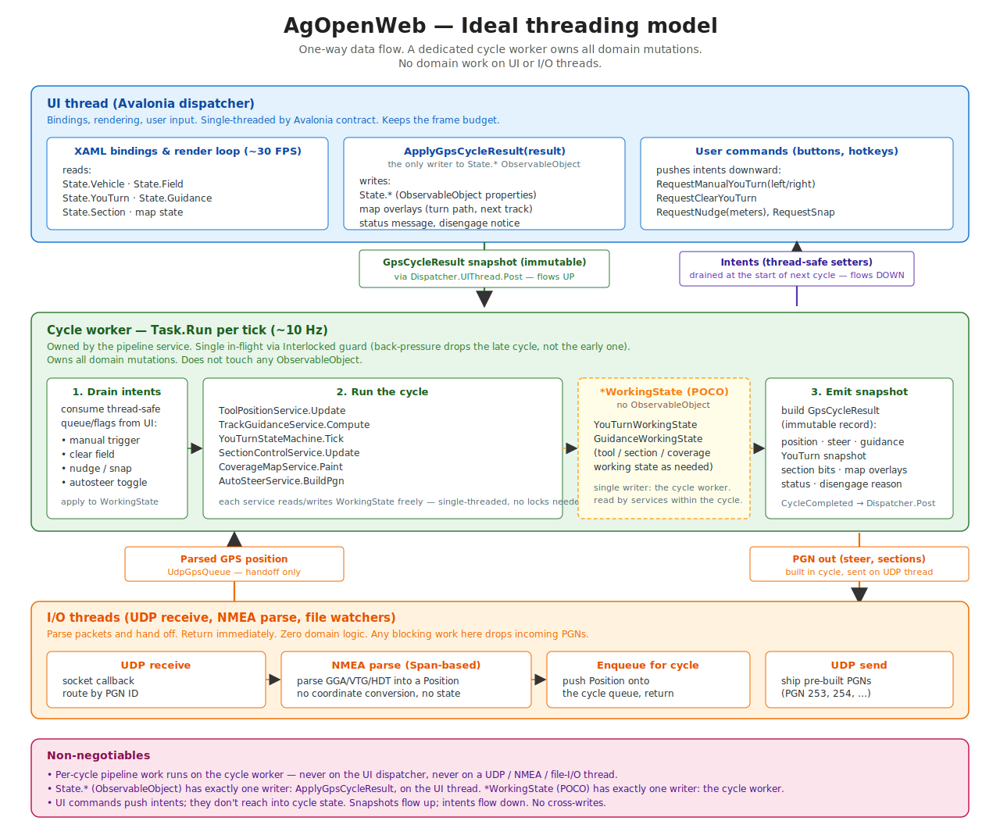

<!--
AgOpenWeb
Copyright (C) 2024-2026 AgOpenWeb Contributors

This program is free software: you can redistribute it and/or modify
it under the terms of the GNU General Public License as published by
the Free Software Foundation, either version 3 of the License, or
(at your option) any later version.

This program is distributed in the hope that it will be useful,
but WITHOUT ANY WARRANTY; without even the implied warranty of
MERCHANTABILITY or FITNESS FOR A PARTICULAR PURPOSE. See the
GNU General Public License for more details.

You should have received a copy of the GNU General Public License
along with this program. If not, see <https://www.gnu.org/licenses/>.
-->

# AgOpenWeb Threading Migration Plan

The authoritative plan for moving AgOpenWeb off the AgOpenGPS /
WinForms threading pattern onto a strict one-way data flow driven by a
dedicated background cycle worker. Covers both the GPS pipeline
unification and the domain-state migration — one plan, six phases, one
threading invariant governing all of them.

Four diagrams, meant to be read together:

| Diagram | Shows |
|---|---|
| [`threading_model_overview.svg`](threading_model_overview.svg) | **Start here.** Current → phases → target in a single frame, with problem-to-phase-to-destination traceability at the bottom. |
| [`threading_model.svg`](threading_model.svg) | The target — ideal threading with the one-way data flow and non-negotiables |
| [`threading_model_current.svg`](threading_model_current.svg) | What's running today, with six numbered problems in red |
| [`threading_model_migration.svg`](threading_model_migration.svg) | The phased migration from current → ideal, showing where each red problem moves and why |

Problem numbers (1–6) and phase letters (A–F) are consistent across all four diagrams, so a reviewer can trace "Problem 1" from today's broken location through Phase C to its ideal home.

> **Strategic, not tactical.** Each phase below describes *what* and *why*.
> Each phase becomes its own implementation branch with its own
> commit-by-commit plan when the work begins.

---

## 0. Threading principle (non-negotiable)

Before anything else, the architecture has to respect this invariant:

> **Per-cycle GPS pipeline work runs on a dedicated cycle worker**
> (`Task.Run` per tick, with single-cycle-in-flight back-pressure via
> `Interlocked`). It does **not** run on the UI dispatcher, and it does
> **not** run on any I/O thread — UDP receive, NMEA parse, file watcher.
> I/O threads parse, hand off, and return immediately.

This is the constraint every state decision below hangs from. Anything that
violates it — for example, collapsing the pipeline onto the UDP receive
thread because it looks simpler — reintroduces the WinForms failure mode in
new paint. The cost of a slow tick is different per thread:

- **UI dispatcher**: dropped frames exactly when the user wants smooth motion
  (mid-turn). Violates `project_fps_floor` on slow devices.
- **UDP receive thread**: delayed packet ingestion; NTRIP corrections stale;
  autosteer PGNs late; in the worst case, socket buffer overruns and lost
  fixes.
- **Cycle worker (Task.Run)**: back-pressure drops the *next* tick, the
  current cycle completes uninterrupted, I/O and UI keep running.

Only the last failure mode is survivable. That's why the cycle worker
exists and why it must stay.

**Historical note — `docs/superpowers/plans/2026-04-19-unify-gps-pipeline.md`:**
That plan identified the GPS pipeline duplication (two parsers, two
LocalPlane instances, split cycle work) and is the origin of Phase B. Its
content is now owned here, reframed under §0 — the unified cycle owner
must retain the `Task.Run` handoff so cycle work doesn't run on the
receive thread. The original document stays in place for Xyntexx's
reference; the work is executed from this plan.

---

## 1. The problem we kept

`State.YouTurn`, `State.Guidance`, `State.Vehicle`, `State.Field`, and
`State.Section` all derive from `CommunityToolkit.Mvvm.ObservableObject`.
Every property write fires `PropertyChanged`. Avalonia 11 does **not**
auto-marshal binding updates from background threads — a write off the UI
dispatcher will throw on the next render.

So the entire shared state graph is implicitly UI-thread-bound. The
`YouTurnStateMachine` we just extracted has to run on the UI thread because
*it mutates `State.YouTurn` directly.* The same is true for the autosteer
disengage path, the headland proximity flag, the section bits — anything
that writes a `State.*` property today.

That's the AgOpenGPS pattern: one mutable observable graph, everyone
mutates it, UI binds to it, last writer wins, races for breakfast. The
YouTurn extraction cleaned up the *organization* of the code, but it
didn't change the *shape* of the data flow. This plan finishes the job.

---

## 2. Target architecture

Two state types per domain:

- **`*WorkingState`** — plain POCO / record. Owned by the cycle worker.
  Mutated freely on the background thread. No `ObservableObject`, no
  `PropertyChanged`, no UI awareness. Single-writer.

- **`*State : ObservableObject`** — the existing UI-bound type. Becomes a
  one-way mirror. **The only writer is `ApplyGpsCycleResult` on the UI
  thread.** No service ever writes to it directly.

Snapshots flow one direction (cycle → UI):

- Cycle worker mutates `*WorkingState` freely during a tick.
- At end of tick, builds an immutable `GpsCycleResult` snapshot.
- Posts it to the UI dispatcher.
- `ApplyGpsCycleResult` writes the snapshot fields onto `State.*`
  (observable), which fires `PropertyChanged`, which updates bindings.

Intents flow the other direction (UI → cycle), batched into the next cycle:

- UI command writes to a thread-safe intent field / queue on the cycle
  worker.
- Cycle worker drains intents at the start of each tick.
- Reacts on that tick.
- Result appears in the UI on the same cycle's snapshot.

Three rules, no exceptions:

1. **Cycle worker never touches `*State : ObservableObject`.** Only
   `*WorkingState`.
2. **VM never mutates `*State` from a service callback.** Only
   `ApplyGpsCycleResult`.
3. **UI commands push intents, they don't reach into cycle-worker state.**

Where this pattern already exists today: `GpsCycleResult.DisplayTrack`,
`GpsCycleResult.SectionStates`, `GpsCycleResult.SteerAngle`. We're not
inventing the pattern — we're applying it consistently.

---

## 3. Why `ObservableObject` stays

We don't replace `*State : ObservableObject`. The view layer still binds
to it; ripping that out would touch every AXAML file. The change is *who
writes to it* and *when*. After the migration:

- `State.YouTurn.IsExecuting` is still bound to UI elements.
- It's still set via `SetProperty(...)` so bindings update.
- The only difference: the call site is `ApplyGpsCycleResult`, on the UI
  thread, reading from a snapshot field on `GpsCycleResult`.

The observable state becomes a "view of last cycle's domain state,"
published at GPS tick rate (~10 Hz). That cadence drives the bindings;
nothing else writes.

---

## 4. Inventory

State objects under `Shared/AgOpenWeb.Models/State/`:

| State object | Today | Plan |
|---|---|---|
| `YouTurnState` | mutated by VM + state machine on UI thread | needs `YouTurnWorkingState` |
| `GuidanceState` | mutated by VM, state machine, pathing service | needs `GuidanceWorkingState` |
| `VehicleState` | mutated by `ApplyGpsCycleResult` (already correct) | already follows pattern |
| `SectionState` | mutated by `ApplyGpsCycleResult` (already correct) | already follows pattern |
| `FieldState` | mutated by VM commands (boundary load, headland gen, drift) | mostly read in cycle; audit only |
| `SimulatorState` | mutated by simulator UI commands | UI-only, no migration needed |
| `RecordedPathState` | mutated by VM | UI-driven, no migration needed |
| `ConnectionState` | mutated by NTRIP/UDP services | services already off-UI; same treatment |
| `UIState` | dialog visibility, panel state | genuinely UI-only, stays as is |

Two are the immediate scope: `YouTurnState` and `GuidanceState`. They
block moving the YouTurn state machine. The others either already follow
the pattern or are genuinely UI-only.

---

## 5. Phased plan

Each phase is a separate branch and PR. A and B are foundation;
C is the proof-of-pattern; D completes the invariant for the hot path;
E and F extend the pattern.

### Phase A — Foundation: state-flow primitives

No behavior change. Define the shapes the rest of the work will use.

- Create `Models.Pipeline.WorkingState/` namespace (or equivalent home —
  see §6.4).
- Define `YouTurnWorkingState` (POCO mirror of `YouTurnState`'s data, plus
  the enum + snake sequence).
- Define `GuidanceWorkingState` similarly.
- Extend `GpsCycleResult` with `YouTurn` and `Guidance` snapshot records.
- Define a pipeline-intents surface:
  `RequestManualYouTurn(bool left)`, `RequestClearYouTurn()`, etc. Backed
  by thread-safe volatile fields or a concurrent queue, drained at the
  start of each cycle.

Ships as scaffolding. No call sites change yet.

### Phase B — Unify the GPS pipeline

Absorbs `docs/superpowers/plans/2026-04-19-unify-gps-pipeline.md`.
Addresses current-state problems **2, 3, and 6**.

The current codebase has two parallel GPS processing paths — a zero-copy
parse into AutoSteer on the receive thread, and a string-based parse into
`GpsPipelineService` via `Task.Run`. That produces: NMEA parsed twice, two
`LocalPlane` instances, cycle work split across two threads, and a PGN
send cadence tied to packet arrival rather than the cycle.

- Merge the two parsers. Keep the `Span`-based `NmeaParserServiceFast`;
  retire `NmeaParserService`.
- Single `LocalPlane` instance, shared via `ApplicationState.Field`.
  Auto-create in exactly one place. Field open/close replaces it.
- Collapse to a single cycle owner (service name to be decided during
  implementation — the critical constraint is §0, not the class name).
  Move `ToolPositionService.Update`, `SectionControlService.Update`,
  coverage painting, and AutoSteer guidance + PGN build into the cycle.
- **Preserve the `Task.Run` handoff.** The receive thread parses NMEA
  into a `Position`, hands it off to the cycle via a queue or volatile
  field, and returns immediately. Heavy work runs on the cycle worker, not
  the receive callback.
- PGN cadence becomes cycle-driven: PGNs are built inside the cycle,
  handed to the UDP send path at end-of-cycle.

After Phase B: one parsed path, one coordinate frame, one cycle owner on a
dedicated worker. The architecture is now coherent enough for the
domain-specific phases to land cleanly.

### Phase C — YouTurn end-to-end

Proof-of-pattern phase. Addresses current-state problems **1, 4, 5**.

- Cycle worker owns a `YouTurnWorkingState` instance. State machine takes
  the working state instead of `YouTurnState`.
- Move the `Tick` call from `MainViewModel.GpsHandling.cs` into the cycle
  worker's per-tick handler. Drop the handler from the VM entirely.
- Cycle emits the YouTurn snapshot in `GpsCycleResult`.
- `ApplyGpsCycleResult` writes the snapshot fields onto `State.YouTurn`.
- Map effects (`SetYouTurnPath`, `SetNextTrack`, `SetIsInYouTurn`) become
  `GpsCycleResult` fields, applied in `ApplyGpsCycleResult` like
  `DisplayTrack` is today.
- `TriggerManualYouTurnLeft/Right` commands push intents instead of
  calling the state machine directly.
- `ClearYouTurnState` becomes a `RequestClearYouTurn` intent.

After Phase C: the YouTurn state machine runs on the cycle worker. The
extraction is genuinely complete. `MainViewModel.YouTurn.cs` shrinks
further (target: under 100 lines).

### Phase D — Guidance state migration

Same pattern, applied to `GuidanceState`. Required because the YouTurn
machine reads/writes `IsHeadingSameWay`, `HowManyPathsAway`, `NudgeOffset`
— which are also touched by other services.

- `GuidanceWorkingState` owned by the cycle worker.
- `TrackGuidanceService`, `YouTurnPathingService`, etc. take the working
  state.
- `ApplyGpsCycleResult` mirrors a `Guidance` snapshot onto `State.Guidance`.
- Nudge / snap commands (`Commands.Track.cs`) become intents.

After Phase D: the entire cycle runs without touching any
`ObservableObject`. UI updates happen exactly once per cycle, at the
marshal point.

### Phase E — `FieldState` careful audit

`FieldState` holds the active field, boundaries, headland, drift. The
cycle *reads* most of these and *writes* `HeadlandProximityDistance` /
`HeadlandProximityWarning` (currently via `ApplyGpsCycleResult` — already
correct). Drift is set by user calibration commands.

This phase is mostly verification — confirm no service writes to
`FieldState` from a background thread, document the read/write
boundaries. Likely small or no-op.

### Phase F — `ConnectionState` for NTRIP / UDP

NTRIP and UDP services run on their own background threads and update
`ConnectionState` directly today. Same risk as the rest. Apply the same
pattern: working state in the service, snapshot to a service-specific
result, VM mirrors on UI thread via a dispatcher post.

May not need a `GpsCycleResult` extension — NTRIP / UDP have their own
update cadence. Could be a separate `INtripStatusObserver` event with a
marshaled payload.

---

## 6. Cross-cutting decisions

Things to lock down before Phase A starts.

### 6.1 Snapshot identity vs equality

When `ApplyGpsCycleResult` writes `State.YouTurn.TurnPath = snapshot.TurnPath`,
`SetProperty`'s reference-equality check detects "no change" only if the
snapshot reuses the same list instance. If the cycle worker produces a
fresh list every tick, `PropertyChanged` fires every tick even when the
path didn't change.

**Decision needed:** does the cycle worker reuse list instances when
state is unchanged, or does the apply path do value-equality checks
before writing? Former is faster; latter is simpler.

### 6.2 Intent batching

Cycle runs at GPS rate (~10 Hz). Manual U-turn click → intent → up to
100 ms before next cycle picks it up. Acceptable for most commands.

But: what if the user clicks twice in 100 ms? Two intents queued, second
overrides? Or both processed (second is no-op because turn is already
running)? Current behavior on the UI thread: second click hits the
"already in turn" guard and prints a status message. Need to preserve
that semantics through the intent queue.

**Decision needed:** intent queue type per command — last-wins (volatile
field) or FIFO queue? For YouTurn, last-wins is probably fine; for
state-changing commands (open field, change vehicle profile) FIFO
matters.

### 6.3 UI commands that need synchronous results

Some UI commands today expect an immediate state change to render in the
same frame (e.g., snap-left button → cyan line jumps). With intent-based
commands, the cyan line jumps on the next cycle tick — up to 100 ms
later.

For most user-perception-critical commands this is fine (humans don't
notice sub-100 ms). Worth confirming per command.

**Decision needed:** is there any command where 100 ms latency is
unacceptable? If so, document the carve-out — but carve-outs are the
only ones allowed to bypass the intent queue.

### 6.4 Where working state lives in source

Two options:

- `Shared/AgOpenWeb.Models/Pipeline/` — alongside the existing state
  types.
- `Shared/AgOpenWeb.Services/Pipeline/WorkingState/` — owned by the
  service that consumes them.

**Lean Models** for testability — the working states want unit tests
independent of any service.

### 6.5 Avalonia 12 future

Avalonia 12 has better cross-thread binding behavior (per memory:
`reference_avalonia12.md`). **We're not waiting for it.** The
one-way-flow design is correct architecturally regardless of what the
binding layer tolerates, and AV12 would only *tolerate* the wrong
pattern, not reward it. Stay the course.

### 6.6 Phase B service name

The absorbed unify-plan targets `AutoSteerService` as the unified cycle
owner. This plan is deliberately silent on the concrete name — the §0
constraint governs regardless of which class ends up hosting the cycle.

**Decision needed:** does the unified service keep the `AutoSteerService`
name, revive `GpsPipelineService`, or take a new name? Surfaces during
Phase B implementation; not a blocker for Phase A.

---

## 7. Acceptance criteria

Per phase:

- All existing tests pass with no behavior changes.
- Smoke test: drive a full field cycle (field open → track follow → auto
  U-turn → next pass → close field) on desktop. No exceptions, no
  rendering glitches.
- For Phase C specifically: `MainViewModel.YouTurn.cs` shrinks to a thin
  property/command file (target: under 100 lines).

Whole-effort:

- Zero direct writes to `State.YouTurn` / `State.Guidance` from any
  service. Enforce via a Roslyn analyzer if practical, otherwise via
  grep in CI.
- The cycle worker never touches an `ObservableObject`. Same enforcement.
- Headland-turn FPS on iPad Pro 2nd gen does not regress (24 FPS floor,
  per `project_fps_floor`). Ideally improves on the create-turn frame.
- `MainViewModel` partials total line count drops measurably (baseline
  captured before Phase C).

---

## 8. What this fixes

- **The "fatal flaw."** Domain logic stops running on the UI thread (or
  sliding onto the UDP thread as an alternative). Background races become
  impossible by construction, not by discipline.
- **YouTurn turn-creation spike.** The 50–200 ms Dubins computation moves
  to the cycle worker after Phase C. UI thread does only the snapshot apply.
  Frame budget intact during turns — exactly when it matters.
- **Testability.** Working states are POCOs; state-machine tests run
  without any view model or dispatcher.
- **Future-proofing.** Adding new domain computation (route planning,
  inner-boundary handling, recorded-path playback) follows a clear
  template instead of accreting new UI-thread mutations.

## 9. What this doesn't fix

- AXAML files still bind to the same observable state. UI layer
  unchanged.
- Configuration mutation (`ConfigurationStore`) is a separate concern.
  Settings changes from the UI propagate through the same
  `ObservableObject` pattern; fine because they're user-initiated and
  infrequent.
- NTRIP / UDP services have their own threading story (Phase F).
- Avalonia 12 upgrade is independent. This plan doesn't depend on it.

---

## 10. Linked plans / memory references

- `Plans/threading_model_overview.svg` — the whole picture in one frame.
- `Plans/threading_model.svg` — target threading model.
- `Plans/threading_model_current.svg` — current reality with numbered problems.
- `Plans/threading_model_migration.svg` — phased migration.
- `Plans/PERFORMANCE_STRATEGY.md` — overall perf umbrella;
  turn-creation cost is one of the items this plan unblocks.
- `docs/superpowers/plans/2026-04-19-unify-gps-pipeline.md` — the other
  active architecture plan; see §6.6 for the coordination point.
- `project_av12_threading` (memory) — the original observation that the
  VM orchestrates too much on the UI thread.
- `project_turns_are_critical` (memory) — turns are the worst-frame
  scenario; Phase C directly targets the spike on the worst frame.
- `project_fps_floor` (memory) — 24 FPS minimum during normal operation;
  acceptance criterion above.
