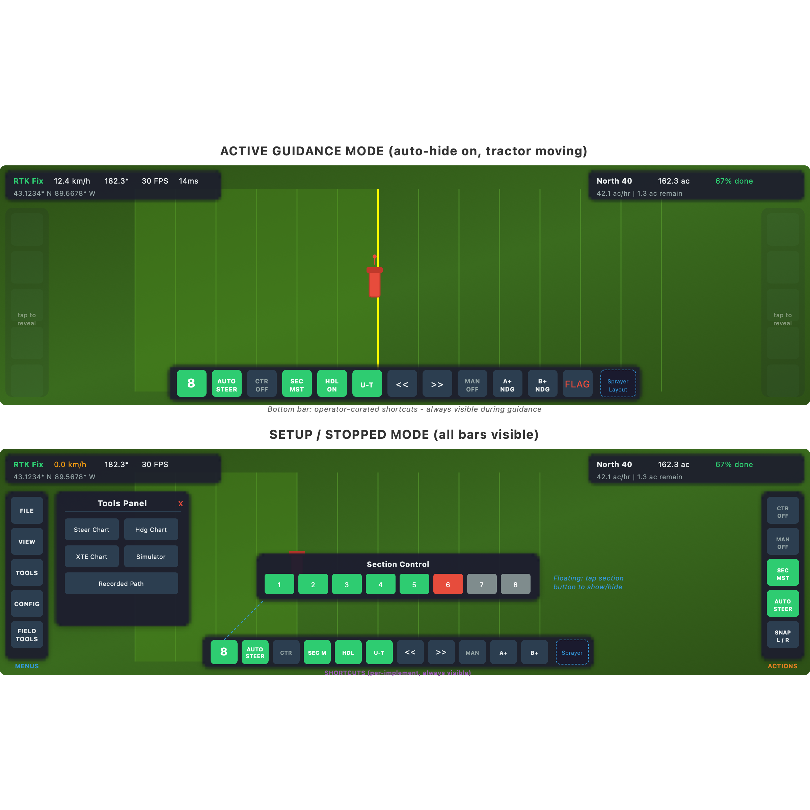

# Toolbar Redesign Plan

## Mockup



*Top: Active guidance mode (tractor moving, auto-hide on) — left/right bars faded, shortcuts always visible. Bottom: Setup/stopped mode — all bars visible, floating section panel shown.*

## Motivation

The current toolbar layout uses floating, draggable panels that clutter the map view, especially on tablets in landscape orientation where vertical space is limited. The two-row section control bar consumes significant vertical real estate. Operators in active guidance mode don't need menus and configuration panels competing for attention with the map.

Research on agricultural and heavy equipment HMI design consistently finds that:
- Operators perform better when interfaces show only task-relevant controls
- Cognitive load increases with the number of visible options
- Predictable, operator-curated layouts outperform automatic context switching
- John Deere's G5 display uses customizable "home pages" per workflow rather than fixed toolbars

## Design Overview

Three zones with distinct roles, plus a floating section overlay:

| Zone | Role | Content | Visibility |
|------|------|---------|------------|
| **Left bar** | Menus & configuration | Settings, tools, fields, job, config, view | Auto-hide option |
| **Right bar** | Full action palette | All available action buttons | Auto-hide option |
| **Bottom bar** | Shortcuts | User-curated shortcuts to any action button | Always visible |
| **Sections** | Floating overlay | Individual section toggles | Summoned by action button |
| **Top** | Status & instruments | StatusBar, FieldStats, LightBar | Always visible |

### Left Bar (Menus & Configuration)

Stays largely as-is. These are "before/after session" controls:
- File Menu
- View Settings
- Tools
- Vehicle Configuration
- Job Menu
- Field Tools
- AutoSteer Config (dialog launcher)
- Data I/O (dialog launcher)

Each button opens its sub-panel as today. The sub-panels anchor in a fixed position rather than floating/draggable (removing the drag infrastructure).

### Right Bar (Full Action Palette)

All action buttons that an operator might use during active work. This is the canonical home for every action button:
- Contour Mode toggle
- Manual Mode toggle
- Section Master toggle
- YouTurn toggle
- Manual U-Turn Left/Right
- AutoSteer toggle
- Section Control (see below)
- U-Turn Skip Rows / Skip Rows toggle
- Section Mapping Color
- Reset Tool Heading
- Section Control in Headland
- Headland toggle
- Flags menu
- Snap Left / Snap Right / Snap to Pivot
- Tram Display Mode
- AB Line menu (Tracks dialog, Auto Track, Quick AB, Boundary Edge, Draw AB)
- Nudge controls (Left, Right, Fine Left, Fine Right, Half-Tool Left/Right, Reset)

Not every button needs to be visible at all times in the right bar. Conditional visibility based on state (e.g., `HasActiveTrack`) still applies here.

### Bottom Bar (Shortcuts)

The operator's personal shortcut bar. Key properties:

- **Shortcuts, not moves.** A shortcut references an existing button from the left or right bar. The original button stays in its home. The shortcut renders the same icon, fires the same command, and binds to the same state.
- **Multiple layouts per implement.** The operator creates named shortcut layouts tied to implement profiles. Switch implement, shortcuts switch automatically.
- **Single row.** The bottom bar is always one row of buttons to minimize vertical space usage.
- **Always visible.** The bottom bar never auto-hides. This is the operator's primary control surface during active work.
- **Configurable via a setup mode.** A "customize shortcuts" mode (accessed from the left bar / File Menu) where the operator can add/remove/reorder buttons. Could use long-press-to-add from right bar, or a dedicated configuration screen.

### Section Control (Floating Overlay)

Sections are handled separately from the toolbar system:

- **Trigger button** lives in the right bar (and can be shortcut to the bottom bar)
- **Button appearance:** Icon shows the section count number (e.g., "8"), background color indicates current control mode (green = auto, yellow = manual, gray = off)
- **Tap to toggle** the floating section panel — appears over the map, tap again to dismiss
- **Floating panel** is the existing `SectionControlPanel` content, no longer anchored to the bottom edge
- **Variable section count** is handled naturally since the panel is independent of bar slot constraints

### Auto-Hide Behavior

A configuration option for left and right bars:

- **Setting:** `AutoHideToolbars` (bool), `AutoHideSpeedThreshold` (km/h), `AutoHideOpacity` (0.0-1.0)
- **Trigger:** Vehicle speed from `GpsService` exceeds threshold
- **Behavior:** Left and right bars animate opacity down to the configured level (e.g., 0.15)
- **Hysteresis:** Small delay / speed deadband to prevent flickering at field edges or during slow turns
- **Ghost touch target:** The faded bar area remains a touch target. Tapping it restores full opacity and re-enables the buttons.
- **Auto-re-fade:** After a configurable timeout (e.g., 5 seconds) with no interaction, bars fade again if still moving
- **Bottom bar is exempt.** Shortcuts stay fully visible and active at all times.
- **Disabled by default.** Operators who want all controls visible at all times simply leave the setting off.

The auto-hide design encourages good shortcut curation: any action button the operator needs while moving should be on their shortcut bar, because accessing a faded bar is a two-tap operation (tap to reveal, tap the button).

## Data Model

### Shortcut Definition

A shortcut is a reference to an existing button:

```csharp
public class ToolbarShortcut
{
    /// Unique identifier for the button being referenced
    /// (e.g., "ToggleAutoSteer", "ToggleContourMode", "SnapLeft")
    public string ButtonId { get; set; }
}
```

The button's icon, command, tooltip, state bindings, and conditional visibility are all resolved from the canonical button definition — the shortcut carries no display logic of its own.

### Shortcut Layout

A named collection of shortcuts tied to an implement profile:

```csharp
public class ShortcutLayout
{
    public string Name { get; set; }
    public List<ToolbarShortcut> Shortcuts { get; set; } = new();
}
```

### Configuration Storage

```csharp
// In ConfigurationStore or a new ToolbarConfig section
public class ToolbarConfiguration
{
    /// All saved shortcut layouts
    public List<ShortcutLayout> ShortcutLayouts { get; set; } = new();

    /// Active layout name (or null for default)
    public string? ActiveLayoutName { get; set; }

    /// Auto-hide settings
    public bool AutoHideToolbars { get; set; } = false;
    public double AutoHideSpeedThreshold { get; set; } = 1.5; // km/h
    public double AutoHideOpacity { get; set; } = 0.15;
    public double AutoHideTimeout { get; set; } = 5.0; // seconds
}
```

Implement profiles in `ConfigurationStore` gain a `ShortcutLayoutName` property to associate a layout with an implement.

### Button Registry

A registry that maps `ButtonId` strings to their display and behavior properties. This allows the shortcut bar to render any button without hardcoding:

```csharp
public class ButtonDefinition
{
    public string Id { get; set; }
    public string Tooltip { get; set; }
    public string IconResource { get; set; }        // avares:// path
    public string? ActiveIconResource { get; set; }  // for toggle buttons
    public string CommandPath { get; set; }           // binding path on MainViewModel
    public string? IsActivePath { get; set; }         // binding path for active state
    public string? IsVisiblePath { get; set; }        // binding path for conditional visibility
}
```

## Migration from Current Layout

### What Gets Removed
- All drag handle infrastructure (DragStarted/DragMoved/DragEnded events, Canvas positioning)
- Per-platform drag wiring in MainWindow.axaml.cs, MainView.axaml.cs
- `SectionControlPanel` as a permanently visible bar (becomes a floating overlay)
- The two-row section layout anchored to the bottom

### What Stays
- All existing button commands and state bindings on `MainViewModel`
- All existing panel content (ViewSettingsPanel, FileMenuPanel, ToolsPanel, etc.)
- StatusBar, FieldStats, LightBar, MapBannersPanel — unchanged
- DialogOverlayHost and the dialog system — unchanged

### What Changes
- `LeftNavigationPanel` — sub-panels anchor in fixed positions, no Canvas drag overlay
- `RightNavigationPanel` — expanded to include all action buttons (absorbs current BottomNavigationPanel actions and flyouts)
- `BottomNavigationPanel` — replaced with new `ShortcutBar` control that renders from `ShortcutLayout`
- `SectionControlPanel` — becomes a floating overlay toggled by a button, not a fixed bar
- New `ToolbarConfiguration` section in config/settings
- New shortcut layout editor UI (accessed from File Menu or a setup wizard)

### Default Shortcut Layout

For new users or first launch, provide a sensible default layout that mirrors the most common current bottom bar buttons:

- Section Control (floating toggle)
- AutoSteer
- Contour Mode
- Section Master
- Manual Mode
- Headland toggle
- Snap Left / Snap Right

This gives a familiar starting point while making it clear the bar is customizable.

## Implementation Phases

### Phase 1: Button Registry & Shortcut Bar
- Define `ButtonDefinition` model and populate registry with all existing action buttons
- Create `ShortcutBar` control that renders buttons from a `ShortcutLayout`
- Create `ToolbarConfiguration` model and persistence
- Replace `BottomNavigationPanel` with `ShortcutBar` using a hardcoded default layout
- Verify all shortcut buttons maintain correct state bindings

### Phase 2: Section Control as Floating Overlay
- Create section control trigger button (count icon, mode color)
- Make `SectionControlPanel` a toggle-able floating overlay
- Remove section bar from fixed bottom position

### Phase 3: Right Bar Expansion
- Move remaining bottom bar actions into the right bar
- Add AB Line flyout content to right bar
- Add Flags menu to right bar
- Verify all actions accessible from right bar

### Phase 4: Shortcut Layout Editor
- UI for adding/removing/reordering shortcuts on the bottom bar
- UI for creating/naming/switching layouts
- Link layouts to implement profiles
- Persist to settings

### Phase 5: Auto-Hide
- Speed-based opacity animation for left and right bars
- Ghost touch target with reveal-on-tap
- Auto-re-fade timeout
- Configuration UI for threshold, opacity, timeout
- Hysteresis to prevent flicker

### Phase 6: Remove Drag Infrastructure
- Remove DragHandle, DragStarted/Moved/Ended from all panels
- Remove Canvas-based positioning for left bar sub-panels
- Anchor sub-panels in fixed positions
- Remove per-platform drag wiring

## Open Questions

1. **Shortcut slot limit** — Should the bottom bar enforce a max number of shortcuts, or scroll horizontally if there are too many? A fixed limit keeps it clean; scrolling keeps it flexible.
2. **Shortcut editing gesture** — Long-press to enter edit mode? Dedicated button? Drag from right bar? All three?
3. **Flyout buttons as shortcuts** — The AB Line and Flags menus are flyouts with sub-buttons. Can the individual sub-buttons (e.g., "Quick AB", "Place Flag Here") be shortcut to the bottom bar directly, or only the flyout trigger?
4. **Right bar grouping** — With more buttons in the right bar, should they be grouped with separators/headers, or is a flat list sufficient?
5. **Implement profile auto-switch** — When the operator changes implement profile, should the shortcut layout switch automatically (if linked) or prompt for confirmation?
